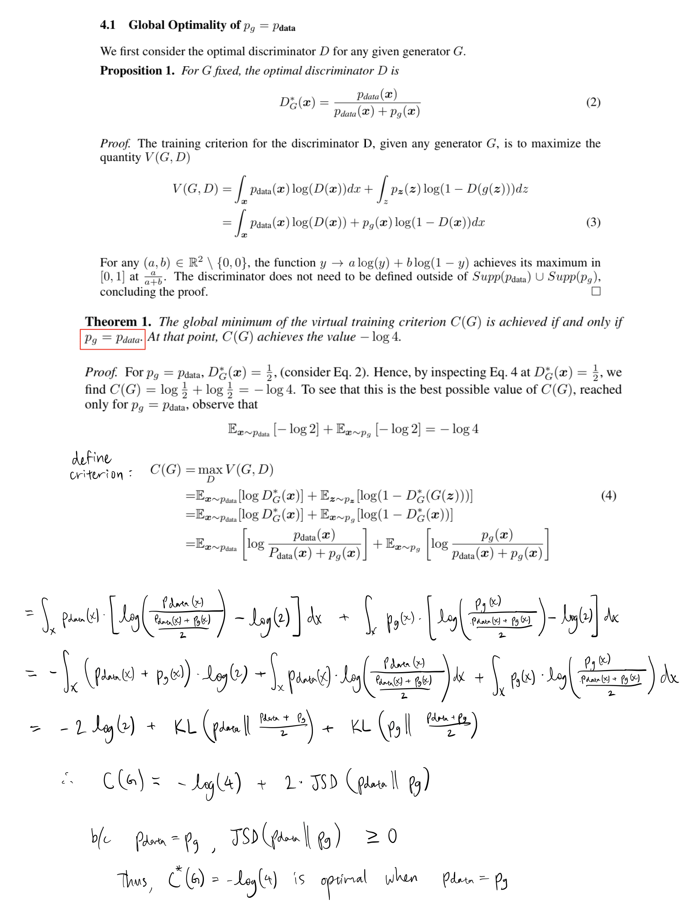

<h1 align="center">Generative Adversarial Networks</h1>

PyTorch implementation of "Generative Adversarial Networks" by Ian J. Goodfellow, Jean Pouget-Abadie, Mehdi Mirza, Bing Xu, David Warde-Farley, Sherjil Ozair, Aaron Courville, Yoshua Bengio.

## Notes
### Proof of Optimality
The handwritten math below shows the work that was omitted in [1].

### Kullback-Leibler Divergence (KL)

### Jensen-Shannon Divergence (JSD)

## References
[[1](https://arxiv.org/abs/1406.2661)] Ian J. Goodfellow, Jean Pouget-Abadie, Mehdi Mirza, Bing Xu, David Warde-Farley, Sherjil Ozair, Aaron Courville, Yoshua Bengio. _Generative Adversarial Networks_. arXiv:1512.03385v1 [cs.CV] 10 Dec 2015.
