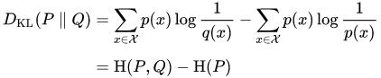

<h1 align="center">Generative Adversarial Networks</h1>

PyTorch implementation of "Generative Adversarial Networks" by Ian J. Goodfellow, Jean Pouget-Abadie, Mehdi Mirza, 
Bing Xu, David Warde-Farley, Sherjil Ozair, Aaron Courville, Yoshua Bengio.

## Notes
### Proof of Optimality
The handwritten math below shows the work that was omitted in [1].

### Kullback-Leibler Divergence (KL)
Also known as **relative entropy**. It measures how much one probability distribution differs from another distribution.

The Kullback-Leibler divergence can also be viewed as **excess entropy**, which is the amount of
extra information that must be communicated for a code that is optimal for **_Q_** but not for **_P_**, compared to a code that
is optimal for **_P_**.

### Jensen-Shannon Divergence (JSD)
The Jensen-Shannon divergence is defined as:

 &emsp; where &emsp; 

**Properties**:
- JSD is non-negative
- JSD is symmetric: `JSD(P || Q) = JSD(Q || P)`
- **JSD is 0 iff P = Q**

## References
[[1](https://arxiv.org/abs/1406.2661)] Ian J. Goodfellow, Jean Pouget-Abadie, Mehdi Mirza, Bing Xu, David Warde-Farley, 
Sherjil Ozair, Aaron Courville, Yoshua Bengio. _Generative Adversarial Networks_. 
arXiv:1512.03385v1 [cs.CV] 10 Dec 2015.
